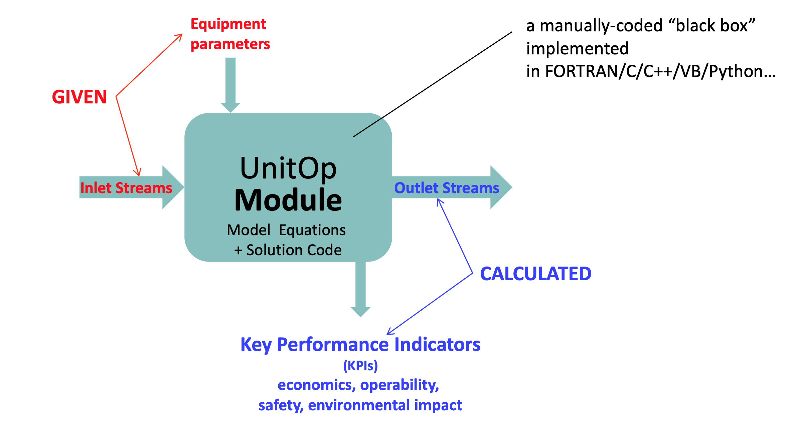
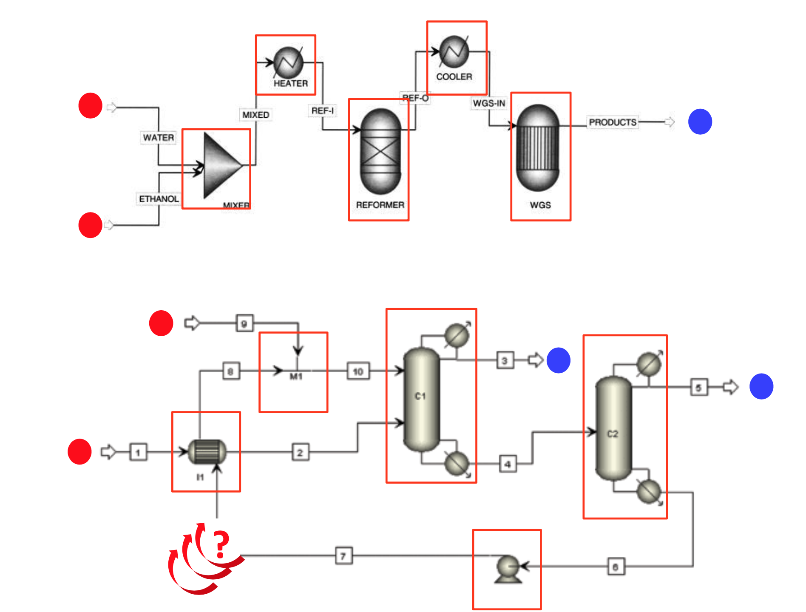
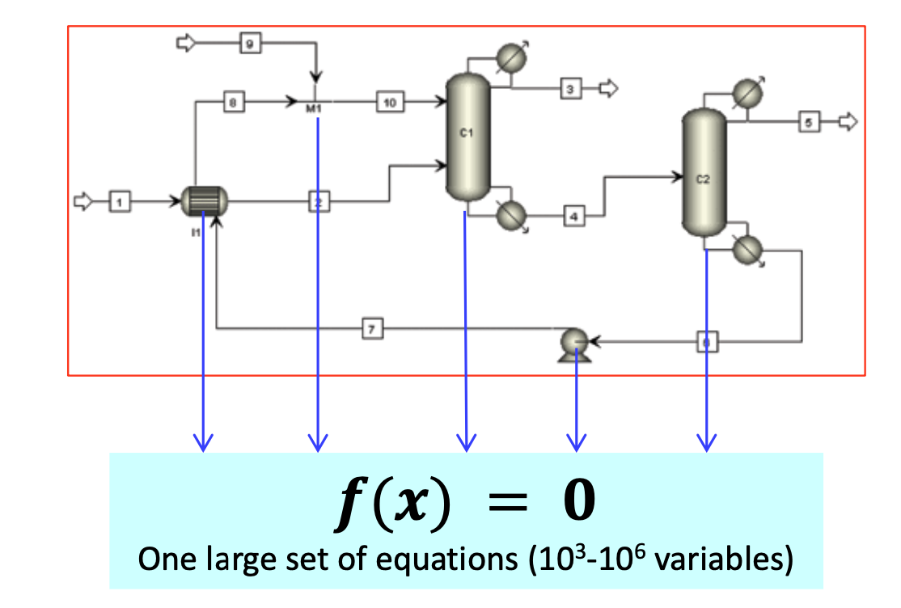

# Two Modelling Paradigms / Approaches / Methodologies

## Sequential Modular

### Existing Software
- Aspen HYSYS®
- Aspen Plus®
- CHEMCAD®
- Petro-SIM®
- PRO/II® 
- Prosim® 
- UniSim®

### Advantages
Manually-coded modules
− very quick for doing simple calculations − especially single-unit ones
− (should) rarely fail
− and even then, can usually issue a meaningful message to the user
− user interface for each module can also be hand-coded − easy to use, can handle any number of “special” features

### Limitations
Manually-coded modules...
− have in-built directionality from inlets to outlets
− can’t easily specify an outlet stream variable and calculate the input
− handling recycles far from straightforward
− may be (very) slow to converge, or even fail to converge (although this may not be apparent to the user)
− difficult to add new “custom” models
− user needs to code the solution method too
− difficult to use for optimization

## Equation Oriented

### Existing Software
- SPEEDUP®→ ACM® gPROMS®
- Aspen Plus® (EO mode) RomEO®
- AVEVA Process®

### Advantages
- Efficient handling of tightly integrated plants with multiple recycles
- Handlingofnon-standard (e.g. design) specifications
- Optimization
- Ease of custom modelling
- No inherent directionality of computation
− can be solved with any valid degree-of-freedom specification
− Multiple recycles do not slow down convergence
− Optimization straightforward with appropriate numerical solvers
− Custom modelling: model developer only needs to provide equations for new unit operations
− solved automatically by the tool together with equations from all other modules

### Limitations
Technically much more complex.
- Need for Automatic index reduction
- 

Lack of robustness.
− Numerical solvers may fail to solve system 𝑓(𝑥) = 0
− ...unless good initial guesses are provided for all key variables
− ...which may be problematic for very large systems – 104 to 106+ variables